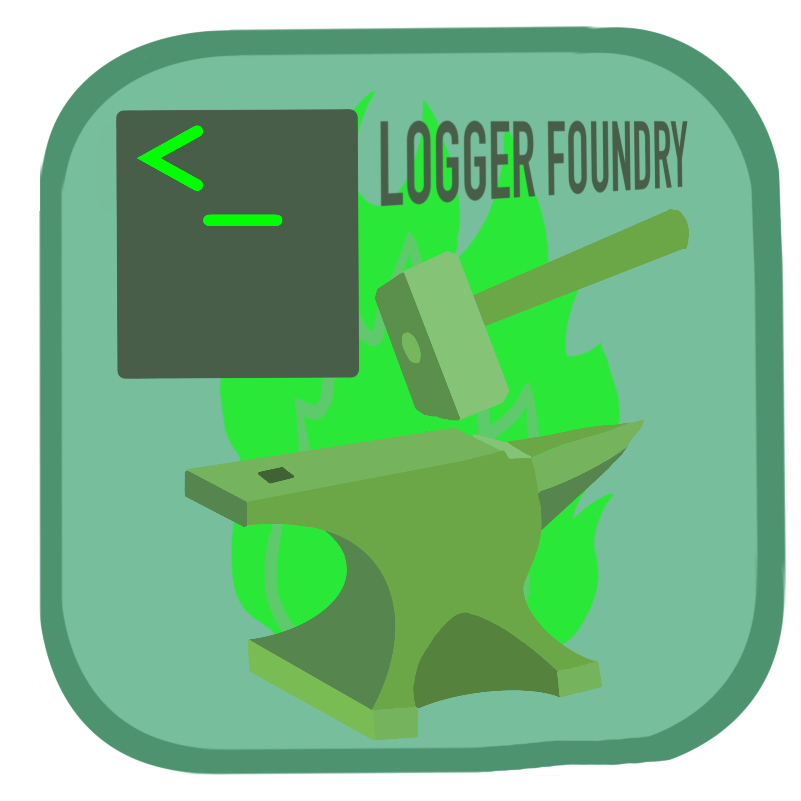

# Logger Foundry 
### A Lightweight, configurable multiprocess logging daemon in C++ with full IPv4, IPv6, and Unix socket support


[](LICENSE.md)


  

### Table of Contents
- [What Logger Foundry Does For You](#what-logger-foundry-does-for-you)
- [The API](#the-api)
- [Logging From Within the Same Process](#logging-from-within-the-same-process)
- [Default Behavior Example](#default-behavior-example)
- [Non-Default Behavior Example](#non-default-behavior-example)
- [Building From Source](#building-from-source-and-project-integration)

### What Logger Foundry Does For You
- Provides a lightweight C++ based interface to easily a spin-up a logger that can listen on multiple Unix and IPv4/v6 sockets - consolidating all messages into a single file. You can also log from the same process with no extra setup.
- Configurable message parsing strategy per logger so that each message ends up in the log file in a format you decide.  
- Configurable daemon kill strategy that allows you to specify exactly how and when the daemon shuts down.  
- Provides default parsing and kill strategies so that you can see it work before making your own.  
- ZERO external runtime dependencies. Just C++ 20 and the Standard Library. All you need out of the box is Python3 to run the build script and verify your installation of those. The script installs the compiler and std lib if they are not in your PATH meaning that Logger Foundry works out of the box.  
- Clean CMake integration. The build script requires an install path so that the header and all libraries go exactly where you want them to.  
- Full process, thread, and concurrency safety.  

### The API
The philosophy of this project is full user autonomy, thus Logger Foundry really only specifies how the pipeline behaves, not where the data comes from, where it goes or how it's processed. That design philosophy is apparent in how you use it.  
Here is an example of how you would launch a daemon:  
```
logger_foundry::logger_daemon orchestrator = logger_foundry::logger_daemon_builder()
    .set_log_path("my_log_path")
    .add_unix_socket("my_socket_path", backlog)
    .add_unix_socket("my_other_socket_path", backlog)
    .add_web_socket("my_ipv4_socket", backlog)
    .add_web_socket("my_ipv6_socket", backlog, "::1")
    .set_parser_strategy(&my_parser_strategy)
    .set_kill_strategy(&my_kill_strategy)
    .build();
```
You have 5 default build options:  
```
set_log_path(std::string log_file_path)
set_parser_strategy(parser_strategy parser_strategy_inst)
set_kill_strategy(kill_logger_strategy kill_logger_strategy_inst)
add_unix_socket(std::string socket_path, uint16_t backlog)
add_web_socket(uint16_t port, uint16_t backlog, std::string host="")
```  
Note that `parser_strategy` and `kill_strategy` are defined as follows (we'll talk more about these later as they look a little bit nasty, but they're really not):  
```
parser_strategy = std::function<std::optional<std::string>(const std::string&)>;
kill_logger_strategy = std::function<void()>;
```
Technically none of them are required and some of them can be used multiple times (but technically nothing is stopping you from using none of them or all of them as many times as you want. It just might not do anything if you do). Lets look at each and explain exactly what they do.  
1. `.set_log_path("my_log_path")`  
Sets the file path that the daemon will write to. If this is called 0 times, the daemon will run, it just won't write to anything. Calling it once is the expected behavior. If you call it multiple times, it will just overwrite what log file path you will write to.  
2. `set_parser_strategy(parser_strategy parser_strategy_inst)`  
Defines how you are going to decode the messages sent into the daemon. You're just receiving characters (bytes). Logger foundry allows you to specify exactly how you want to decode those bytes and put them in the log file. `parser_strategy` is just an alias for `std::function<std::optional<std::string>(const std::string&)>`. You define a function with a signature `std::optional<std::string> my_byte_parser(const std::string& bytes)`. Functionally you take in a string and manipulate it into the form that you want in the log file. It's wrapped in an optional type so that you can specify an `std::nullopt` for certain messages you don't want in the log file that will be ignored by the rest of the daemon system. The parser strategy can be defined 0 times, which uses a default parser that just directly prints the received message with an appended newline to the logfile. If this build argument is called once, the daemon will use that strategy. If you define it more than once, it will override the strategy, as with setting the log file path.  
3. `set_kill_strategy(kill_logger_strategy kill_logger_strategy_inst)`  
This defines how the daemon will be shutdown (close all socket connections, flush remaining log messages, and kill all threads). `kill strategy` is just an alias for `std::function<void()>`. Functionally the daemon spins up a monitor thread that periodically watches for the kill condition to be met, signals the other components to shutdown. Basically, once the kill strategy function returns from execution, the monitor thread joins and signals a shutdown. If the kill strategy isn't defined, then the daemon never shuts down and lives indefinitely until a `SIGINT` is received. If this build argument is called once, the daemon will shutdown based on the user defined strategy. If you call it more than once, it will overwrite the previous kill strategy as with setting the log file path.  
4. `add_unix_socket(std::string socket_path, uint16_t backlog)`  
This tells the daemon to listen on a Unix Socket. **NOTE:** that the user is responsible for creating the `.sock` file and verifying it's existence before building the daemon with a Unix Socket with this parameter. The two arguments are `socket_path` and `backlog`. `socket_path` specifies where the `.sock` file used for this connection lives. `backlog` specifies how many pending connections that can be queued while the daemon isn't actively accepting the connection. If this build argument is called 0 times, the daemon doesn't listen on any Unix Sockets. If it is called 1 or more times, the daemon will listen on all Unix Sockets specified.  
5. `add_web_socket(uint16_t port, uint16_t backlog, std::string host="")`  
This tells the daemon to listen on a particular port (host parameter is optional and currently unused). **NOTE:** that the user is responsible for opening the port and verifying that it is open before building the daemon with this parameter. The two used arguments are `port` and `backlog`. `port` specifies which port the daemon will listen on for incoming connections. `backlog` specifies how many pending connections that can be queued while the daemon isn't actively accepting the connection. This should be IPv4/IPv6 agnostic. If this build argument is called 0 times, the daemon doesn't listen on any IP Sockets. If it is called one or more times, the daemon will listen on all IP Sockets (ports) specified.  

### Logging From Within the Same Process
Sometimes you don’t need sockets — or you want to log internal events from the same process without going through the socket stack. Logger Foundry provides that too: `void log_direct(std::string msg);`. Just call it as a method on the logger daemon object you constructed.  

### Default Behavior Example
Default behavior would look as follows. This is the output of one of the end-to-end continuous integration tests listening on 2 Unix Sockets, 1 IPv4, and 1 IPv6 socket.  
```
HELLOOOO FROM SOCKET 1
HELLOOOO FROM SOCKET 2
HELLOOO FROM IPV4
HELLOOO FROM IPV6
```

### Non-Default Behavior Example
Look at [Pyroxene.V2](https://github.com/dgunther2001/pyroxene_v2/tree/main/logger_daemon_pyroxene)'s for inspiration on how to write your `parser_strategy` and `kill_strategy`. Here is the logger configuration Pyroxene.V2 uses:  
```
logger_foundry::logger_daemon orchestrator = logger_foundry::logger_daemon_builder()
    .set_log_path(std::getenv("PYROXENE_LOG_PATH"))
    .add_unix_socket(std::getenv("PYROXENE_LOG_SOCKET_PATH"), 20)
    .set_parser_strategy(&pyroxene_default_parser::pyroxene_default_parser)
    .set_kill_strategy([] {
        pyroxene_shutdown_strategy::monitor_feeding_processes();
    })
    .build();
```
Here is the output with some very simple log messages using those strategies:  
```
14:14:54  [DEBUG]  [Logger Orchestrator]  [C++]  Orchestrator Initializing Threads 
14:14:54  [DEBUG]  [Logger]  [C++]  Logger Invoked 
14:14:54  [WARN]  [Logger]  [C++]  Logger Invoked 
14:14:54  [ERROR] [Logger]  [C++]  Logger Invoked 
14:14:54  [DEBUG]  [Logger]  [C++]  Logger Invoked 
14:14:54  [WARN]  [Logger]  [C++]  Logger Invoked 
14:14:54  [ERROR] [Logger]  [C++]  Logger Invoked 
14:14:55  [DEBUG]  [Haskell Main]  [Haskell]  Haskell Main Entered 
```

### Building From Source and Project Integration

**Building From Source:**  
1. `git clone /url/to/this/repository/`  
2. `python3 build_logger_foundry.py --cmake-prefix /path/to/desired/install/location`  

**Integration into CMake and Project:** 
In your root level `CMakeLists.txt` do the following:  
&emsp; Verify that the package is available:  
&emsp; `find_package(logger_foundry desired_version_number REQUIRED)`  
&emsp; Add an executable or a library:  
```
add_executable(my_executable
    my_file.cpp
)

#OR

add_library(my_library
    my_file.cpp
)

target_include_directories(my_library PUBLIC ${CMAKE_CURRENT_SOURCE_DIR})
```
&emsp; Link Logger Foundry into your library or executable:  
&emsp; `target_link_libraries(my_executable_or_library PRIVATE logger_foundry::logger_foundry)`

**Building Your Project:**  
After integrating with CMake, MAKE SURE that your `LD_LIBRARY_PATH` is set to where Logger Foundry was built (same as `--cmake-prefix`) before building your project.  

**That's it. It's that easy.**  

**NOTE:** as per the [License](LICENSE.md), Logger Foundry is released under the PolyForm Noncommercial License 1.0.0. If you wish to use Logger Foundry in a commercial product, you must contact me to arrange a separate agreement.